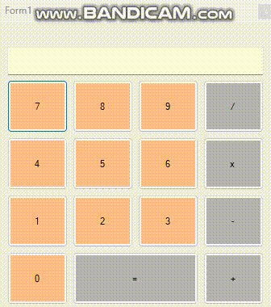

# kalkulator-gui
Kalkulator ini dapat digunakan untuk melakukan perhitungan sederhana seperti penjumlahan, pengurangan, perkalian dan pembagian.  
User cukup menekan angka yang ingin dihitung lalu tekan simbol hitung dan masukkan angka berikutnya yang ingin dihitung, setelah selesai user menekan simbol sama dengan maka akan menampilkan hasil perhitungannya. 
 

